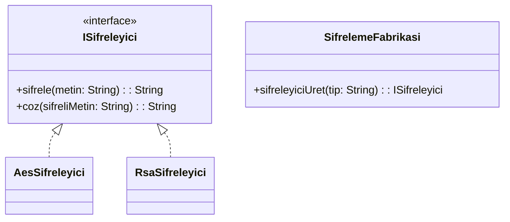
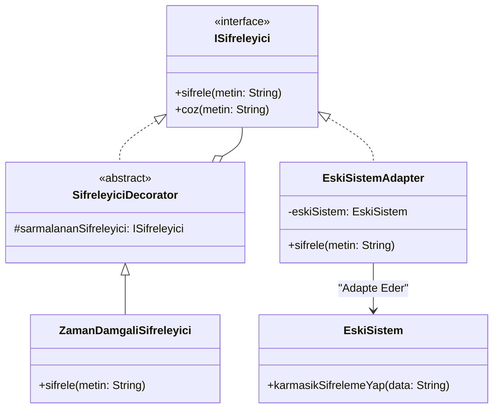

# Tasarım Örüntüleri Dokümantasyonu

## Faz 1 - Factory Method (Creational)

**Nerede Uygulandı?**
`SifrelemeFabrikasi` sınıfında uygulandı.

**Neden Uygulandı?**
Eski yapıda nesne yaratma mantığı ile iş mantığı aynı sınıf (`SifrelemeAraci`) içerisindeydi. Yeni algoritma eklemek zordu.

**Ne Kazandık?**
Nesne üretme sorumluluğunu fabrikaya devrederek sınıfların birbirine sıkı sıkıya bağlı (tight coupling) olmasını engelledik.

### UML Sınıf Diyagramı (Faz 1)

---

## Faz 2 - Decorator & Adapter (Structural)

### 1. Decorator Pattern
**Nerede Uygulandı?**
`SifreleyiciDecorator` abstract sınıfı ve `ZamanDamgaliSifreleyici` sınıfında uygulandı.

**Neden Uygulandı?**
Şifreleme sonuçlarına ek özellikler (örneğin işlem zamanı damgası) eklemek istedik. Bunu var olan `AesSifreleyici` gibi sınıfların içine yazsaydık kod tekrarlarına ve sınıfların şişmesine yol açacaktık (OCP ihlali).

**Ne Kazandık?**
Çekirdek şifreleme sınıflarına dokunmadan, çalışma zamanında nesnelere yeni davranışlar ekleme esnekliği kazandık.

### 2. Adapter Pattern
**Nerede Uygulandı?**
`EskiSistemAdapter` sınıfında uygulandı.

**Neden Uygulandı?**
Üçüncü parti / eski bir kütüphane olan `EskiSistem` sınıfının metod isimleri, bizim projemizin `ISifreleyici` arayüzüne uymuyordu.

**Ne Kazandık?**
Eski kodu değiştirmeden (zaten değiştiremeyiz), onu bizim sistemimizin anladığı bir formata çevirdik.

### UML Sınıf Diyagramı (Faz 2 Mimari Güncellemesi)

