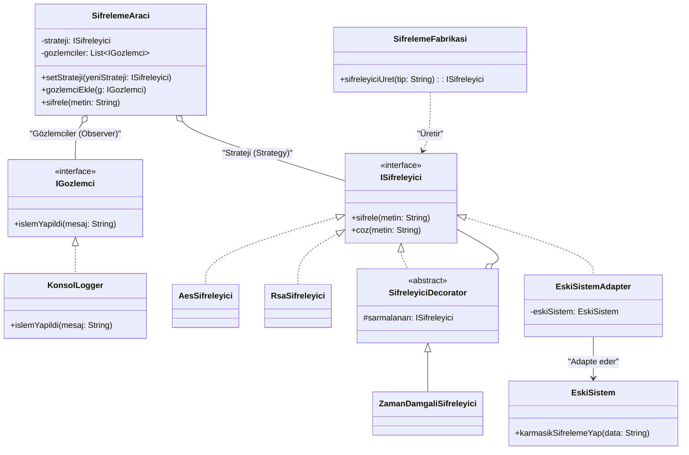

# Tasarım Örüntüleri Dokümantasyonu

## Faz 1 - Factory Method (Creational)
**Nerede Uygulandı?** `SifrelemeFabrikasi`
**Ne Kazandık?** Nesne üretim mantığı ile iş mantığı birbirinden ayrıldı.

## Faz 2 - Decorator & Adapter (Structural)
**Nerede Uygulandı?** `ZamanDamgaliSifreleyici` (Decorator) ve `EskiSistemAdapter` (Adapter).
**Ne Kazandık?** Eski kodlara dokunmadan yeni özellikler ekleme ve uyumsuz dış kütüphaneleri sisteme entegre etme.

---

## Faz 3 - Strategy & Observer (Behavioral)

### 1. Strategy Pattern
**Nerede Uygulandı?** `SifrelemeAraci` içindeki `setStrateji(ISifreleyici)` metodu.

**Neden Uygulandı?**
Kullanıcının program çalışırken algoritmayı (AES'ten RSA'ya) değiştirebilmesi gerekiyordu. 

**Ne Kazandık (OCP Katkısı)?**
Açık/Kapalı prensibini (OCP) çok net şekilde sağladık. Uygulamanın davranışı (`strateji`) runtime'da dışarıdan değiştirilebiliyor, var olan kod değiştirilmeden yeni yetenekler eklenebiliyor.

### 2. Observer Pattern
**Nerede Uygulandı?** `IGozlemci`, `KonsolLogger` ve `SifrelemeAraci`'nın `gozlemcilereHaberVer` mekanizmasında.

**Neden Uygulandı?**
Şifreleme aracı bir işlem yaptığında başka sistemlerin (örn. Logger mekanizması) bundan haberdar olması gerekiyordu, ancak şifreleme aracının Logger'ı doğrudan tanıması (sıkı bağ) istenmiyordu.

**Ne Kazandık?**
Modüller birbirinden bağımsız hale geldi. Şifreleme aracı sadece olayları "yayınlar", kimin dinlediğiyle ilgilenmez.

### Final UML Mimari Diyagramı (Tüm Fazlar)

