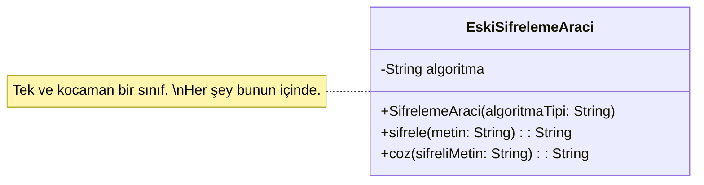
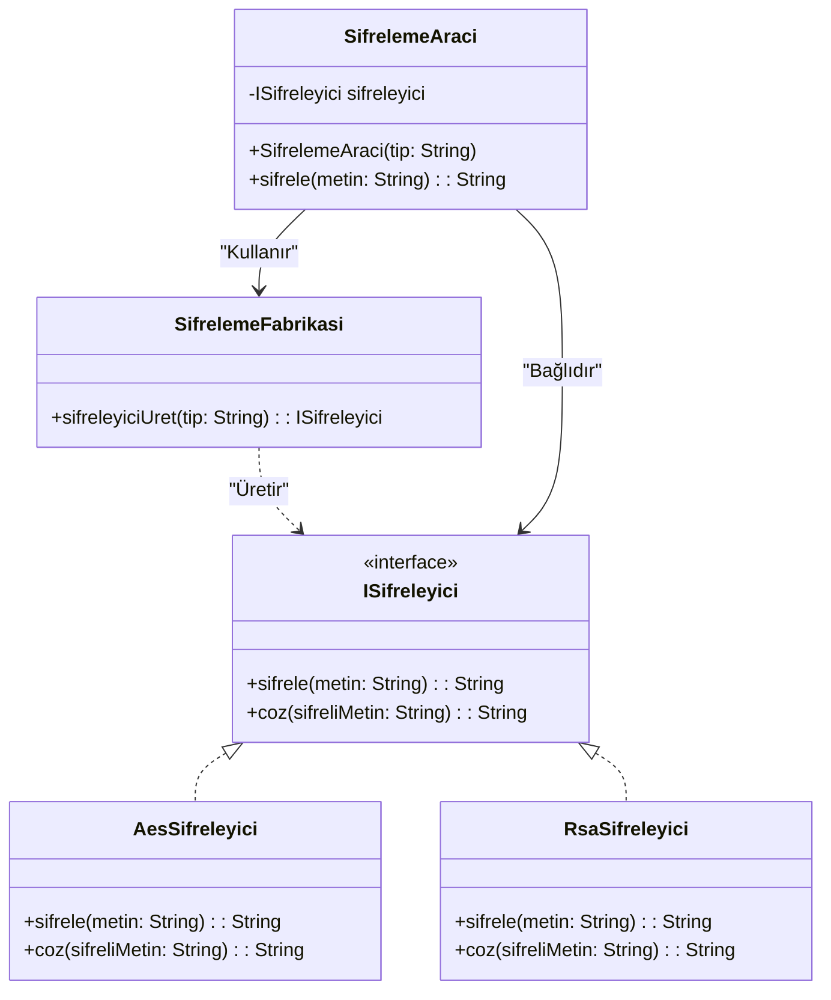

# Tasarım Örüntüleri Dokümantasyonu

## Faz 1 - Factory Method (Creational)

**Nerede Uygulandı?**
`SifrelemeFabrikasi` sınıfında uygulandı.

**Neden Uygulandı?**
Eski yapıda nesne yaratma mantığı (hangi algoritmanın seçileceği) ile iş mantığı (şifreleme süreci) aynı sınıf (`SifrelemeAraci`) içerisindeydi. Yeni bir şifreleme algoritması ekleneceğinde mevcut sınıfın değişmesi gerekiyordu (Single Responsibility ve Open/Closed prensibi ihlalleri).

**Ne Kazandık?**
Nesne üretme sorumluluğunu fabrikaya devrederek sınıfların birbirine sıkı sıkıya bağlı (tight coupling) olmasını engelledik. Yeni bir şifreleme algoritması geldiğinde sadece fabrikayı güncelleyip yeni bir sınıf eklemek yetecek.

### UML Sınıf Diyagramı (Önce ve Sonra)

