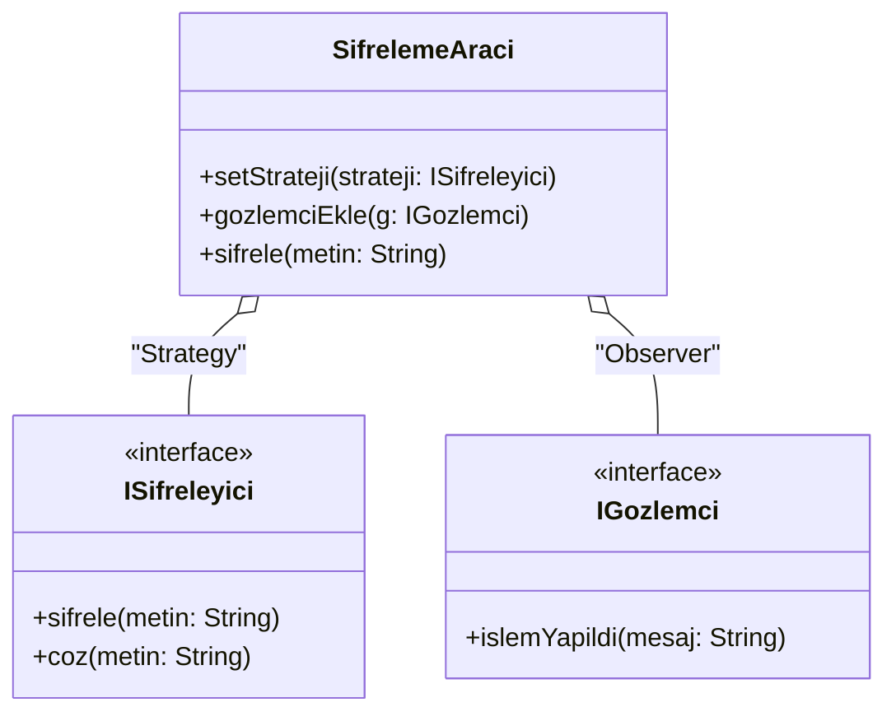

# Tasarım Örüntüleri Ödevi - Şifreleme Aracı 🔐

**Seçilen Konu:** E - Şifreleme Aracı  
**Gerekçe:** Şifreleme algoritmalarına siber güvenlik alanınından ilerlemek istediğim için ilgim vardı bu yüzden seçtim. İlk başta her şey "if-else" ile halledilir sanıyordum ama işler büyüdükçe kodun koca bir çöplüğe (Spagetti Koda) dönüştüğünü fark ettim.

## Proje Ne Yapıyor?
Bu proje, metin tabanlı verileri çeşitli şifreleme algoritmaları (AES, RSA, Base64 ve 3. Parti Kütüphaneler) ile şifreleyen ve daha sonra geri çözen dinamik bir uygulamadır. Runtime (çalışma zamanında) algoritma değiştirebilir ve şifreleme işlemlerini loglayabilir.

## Kullanılan Tasarım Örüntüleri
Proje boyunca uyguladığım tasarım örüntüleri:

1. **Factory Method (Creational):** Nesne yaratma işini (AES mi, RSA mı?) ana iş akışından kopartıp bir Fabrika sınıfına (`SifrelemeFabrikasi`) devrettim. 
2. **Decorator (Structural):** Şifrelenmiş metinlere ekstra olarak "Zaman Damgası" eklemek için çekirdek sınıfları bozmadan üzerlerine bir katman (`ZamanDamgaliSifreleyici`) giydirdim.
3. **Adapter (Structural):** Dışarıdan aldığım ve metot isimleri benimkine hiç uymayan legacy bir kütüphaneyi (`EskiSistem`), sistemi bozmadan kullanabilmek için bir Adaptör (`EskiSistemAdapter`) yazdım.
4. **Strategy (Behavioral):** Algoritma seçimini `if-else` yığınından kurtarıp tamamen sınıflara böldüm. Kullanıcı program çalışırken `setStrateji` ile algoritmayı istediği an değiştirebilir (Açık/Kapalı Prensibi - OCP).
5. **Observer (Behavioral):** Şifreleme ve Deşifreleme yapıldıkça başka modüllerin (örn. `KonsolLogger`) haberdar olması için Gözlemci-Yayıncı mantığı kurdum.

## Mimari Diyagram


*(Tüm diyagramın ayrıntılı hali için `PATTERNS.md` dosyasına bakabilirsiniz.)*

## Nasıl Çalıştırılır?
Projeyi terminalden veya komut satırından derleyip tüm tasarım örüntülerinin ahenk içindeki çalışmasını test edebilirsiniz...

```bash
# Projenin ana dizinindeyken:
javac -encoding UTF-8 src/*.java
java -cp src Main
```

---
**Hocamın Notu:** AI günlüklerim (`docs/ai-log/`) ve tespit ettiğim problemler (`PROBLEMS.md`) repoda duruyor. Ödev boyunca GitHub Actions ve PR denemeleri de yaptım. Her fazı kendi branch'inde tasarladım. Okuduğunuz için teşekkürler!
